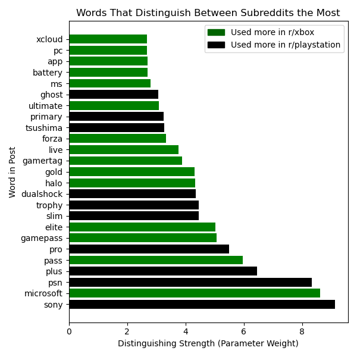

# Subreddit NLP Classification

## Background

On the social media platform Reddit, you can find countless highly active communities dedicated to discussing any topic you can imagine. The startling number of Reddit's individual communities, known as subreddits, means that topics as broad as literature or as narrow as a single video game can often be counted on to have their own page filled with the writings of dedicated redditors. As a result of this, however, Reddit also has many communities whose topics of discussion overlap with those of another.

One such pair of communities are the subreddits r/playstation and r/xbox. Both communities focus on discussing video games, with a significant overlap in discussion topics due to their tendency to discuss high-profile events in the gaming world. Despite this seeming overlap, both communities have a history of competition and petty disagreement with one another. As a result, their members have often argued that a clear distinction exists between them in what they choose to discuss, beyond their surface-level preferences for different consoles.

Recently, a small subset of both communities have attempted to introduce close friends and family to their personal favorite subreddits over thanksgiving, only to be met with confusion as they struggle to convince them that these communities differ in any way other than which gaming console their users own. Hoping to better explain the divide between each subreddit, wealthy individuals from each group have hired a data scientist to obtain some kind of objective proof of these perceived differences.

As the data scientist entrusted with this task, the goal of this project is to provide proof to the users of the subreddits r/playstation and r/xbox of whether or not their communities' topics of discussion differ in any way other than in their choice of console. This will be accomplished by using natural language processing (or NLP) to train a machine learning model that can distinguish between posts from r/playstation and posts from r/xbox. The words determined to be most important to the most accurate model will be used to infer the topics of discussion that differentiate both communities.

## Modelling Process

In the modelling process, our reddit dataset was first cleaned of missing or outlier data points that could harm our model's training process.

Following this, the dataset was put through several natural language processing steps wherein meaningless words, verb conjugations, and punctuation were all removed in order to distill the data down to the components that the model is interested in. This cut down reddit data was them transformed into a numeric format that our model can understand.

Using this transformed data, three different classifier models were trained and the model with the highest accuracy, a Logistic Regression model, was chosen to be the model that would be interpreted in order to understand the differences between our two subreddits.

## Model Interpretation

In this plot of feature weights, we can see that nearly all the words the model deems most important when distinguishing between subreddits fall within one of three general categories.

Words such as 'psn', 'plus', 'live', and 'gamepass' all reference online services that can be found on the consoles that our two subreddits are names after. 'psn' and 'live' refer to the Playstation Network and Xbox Live respectively, which are the networks that each console uses to facilitate online interactions such as player messaging and online purchases. Similarly, 'plus' and 'gamepass' refer to Playstation Plus and Xbox Game Pass, which are online subscription services that each consoles offer that allow users to access a rotating library of games. The majority of words deemed important by the model reference online services in some way.

Words such as 'dualshock' and 'battery' reference peripheral devices such as controllers that are used by each subreddit's console. 'dualshock' is associated with r/playstation because Playstation consoles all use a series of controllers known as Dualshocks to allow users to play their games. Similarly, 'battery' is associated with r/xbox because the Xbox is the only major console to still offer controllers that use disposable batteries instead of rechargable ones.

Most relevant to us however, are the words 'ghost', 'tsushima', 'halo', and 'forza'. These words all refer to games that happen to be console-exclusive. Ghost of Tsushima is a high-profile game exclusive to the Playstation 4 and 5, while both Halo and Forza are long-running game franchises exclusive to the Xbox. The presence of these words in our list of highly-weighted model features suggests that these games are only a topic of discussion in the subreddit for the console that they are exclusive too.

Of all the words shown above, only one does not fit into any of these categories. That word being 'pc'. The presence of 'pc' is highly predictive of a post being from the xbox subreddit. This is because several Microsoft gaming services available for xbox, such as Game Pass, are actually available on PC platforms as well and reddit users interested in these services often start discussions on r/xbox.

## Conclusions and Recommendations

Looking at the list of high-importance words in our trained model we can see that the vast majority of the differences in discussion topics between the subreddits r/playstation and r/xbox are explicitly focused on their respective consoles. Nearly all of the most important words in our model reference either console software (such as for online functionality) or console hardware (such as controllers).

However, there are two differences in discussion topics between the two communities that are less explicitly about any given console. Firstly, The two subreddits can be seen to discuss different video games, due to many games electing to not release on all platforms. And secondly, the Xbox subreddit has a greater tendency to discuss PC games than the Playstation subreddit due to Microsoft's gaming services being available on PC as well.

With these inferences in mind, it is recommended that any redditors seeking to explain the non-console-related differences between these communities make an effort to convey both the difference in game preferences within each subreddit and the difference in how much each subreddit discusses PC gaming.